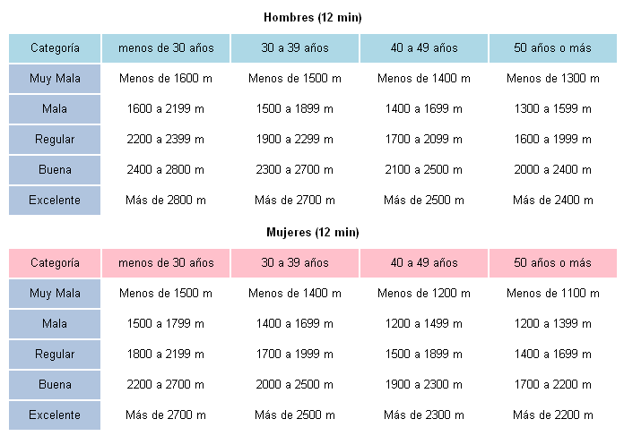

Calculating Aerobic condition
========================================================
author: Ramiro Villegas
date: Junio 10 de 2015
transition: rotate
Definitions
========================================================

**VO2 Max**
VO2 max is the maximal oxygen uptake or the maximum volume of oxygen 
that can be utilized in one minute during maximal or exhaustive exercise. 
It is measured as milliliters of oxygen used in one minute per kilogram 
of body weight.

**Cooper Test**

Cooper test is an easy way to calculate the VO2 Max, and know the aerobic condition of the 
runner

Cooper Test
========================================================

The test consist to measure the distance in meters in 12 minutes. With this information, the VO2Max
can be calculated with the following formula:

**VO2 max = 22,351 * distance(m)/1000 - 11,288**

With the VO2 max, the age and sex the aerobic condition can be determined.

Aerobic condition table
========================================================

Conclusions
========================================================

There are other complex methods and machines to calculate the VO2 Max, but the cooper test is
practical and the results can be taken every day to run and with this information know how to improved aerobic fitness.

[Click here to go to the link I take the information and picture](http://burgalesesenelrunning.blogspot.com/2012/03/test-de-cooper-y-vo2-max.html)

